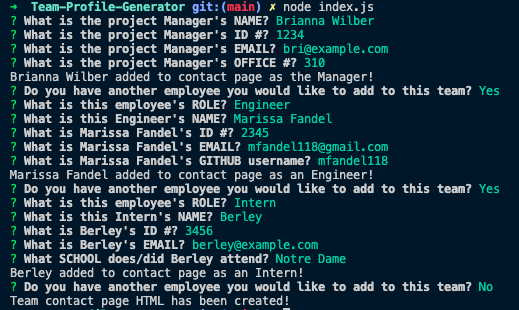
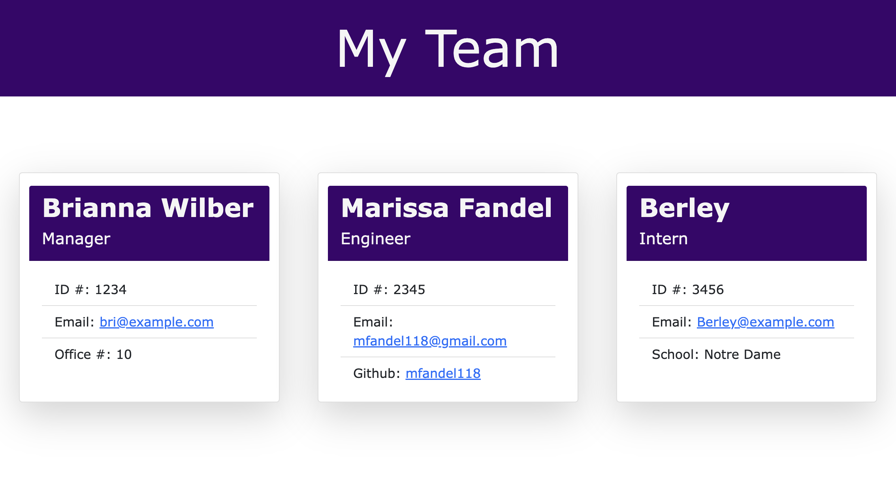

# Team Profile Generator

## Table of Contents:

- [Description](#description)
- [Usage](#usage)
- [Installation](#installation)
- [Link to Deployed Application](#link-to-deployed-application)
- [Link to GitHub Repo](#link-to-github-repo)
- [Screenshots](#screenshots)
- [Questions](#questions)

[](https://opensource.org/licenses/)

## Description

The purpose of this applciation is to provide a program where users can store all the necessary contact information for their project's team.

## Usage

When the application begins, the user is prompted to supply contact information for their team's Manager as well as any additional employees (either Engineers or Interns). The user can add as many employees to the roster as needed. Once all the employees' info has been added, an index.html file is generated in the "dist" directory. The index.html file will contain all the contact information for the team, ready to be opened in a browser.

## Installation

First clone down the repository from github (see github URL below). Then run

```
node index.js
```

in the terminal. Make sure you are in the correct directory, "Team-Profile-Generator".

## Link to GitHub Repo

https://github.com/mfandel118/Team-Profile-Generator

## Screenshot(s)




## Questions

Any additional questions about this project? Please feel free to reach out:

Marissa Fandel

- Email: mfandel118@gmail.com
- GitHub: https://github.com/mfandel118
